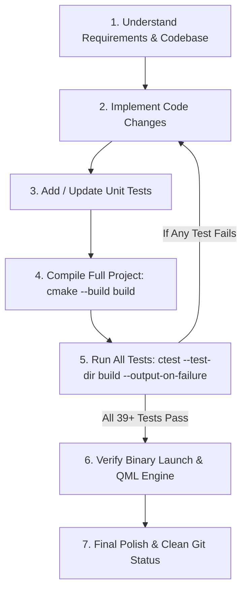

# AGENTS.md — Developer & AI Agent Guide for WaveFlux

Welcome to **WaveFlux**! This document serves as the primary reference, architectural guide, and operational protocol for AI Agents (and human developers) working on the WaveFlux codebase.

---

## 1. Project Overview & Tech Stack

**WaveFlux** is a modern, high-performance, cross-platform audio player written in modern C++ (C++20) and Qt 6 / QML.

- **Language & Standards**: C++20, Qt 6.5+, QML (Qt Quick / Qt Quick Controls 2), Kirigami (KDE Frameworks 6).
- **Build System**: CMake (minimum 3.21) with `qt_add_qml_module`.
- **Audio Engines & Dual-Backend Routing**:
  - **GStreamer 1.0**: Primary pipeline for standard audio playback (FLAC, MP3, AAC, OGG, Opus, WAV, ALAC, DSD, CUE sheets, streaming).
  - **libopenmpt / TrackerPcmEngine**: Native tracker engine for module formats (MOD, XM, S3M, IT, UMX, etc.) with custom waveform rendering.
  - **PlaybackBackendRouting**: Automatic format inspection routing audio between GStreamer and OpenMPT backends.
- **DSP Engine & Signal Processing**:
  - 10-band graphic equalizer with preset management.
  - ReplayGain & amplitude normalization (Track/Album modes, peak dBFS, tag extraction, fallback gain).
  - Fletcher-Munson dynamic loudness compensation for low-volume listening.
  - Stereo balance, smooth volume transitions (48ms ramp), logarithmic volume taper.
  - Silence detection & trimming (intro skip, trailing silence elimination for EOS advance, mid-track silence skip).
  - Fade effects (pause/resume fades, track navigation fades, crossfading mixing modes).
  - Varispeed playback (speed adjustment with proportional pitch scaling) vs independent DSP tempo (constant pitch).
- **Lyrics Subsystem**:
  - Native multi-tier lyrics synchronization engine (`src/lyrics/`).
  - High-performance LRC parser with UTF-8/UTF-16 auto-detection and word-tag stripping.
  - Diacritic-insensitive fuzzy matcher and ranking engine.
  - Dedicated SQLite cache (`lyrics_cache.db`) with 30-day positive / 6-hour negative TTL and LRU eviction.
  - Multi-source provider architecture: Local sidecars (`.lrc`, `.txt`, CUE-indexed `.trackNN.lrc`), LRCLIB API, and Lyrics.ovh fallback.
  - Real-time binary search synchronization with CUE sheet track offset subtraction, A-B loop boundary clamping, manual offset adjustment (-/+100ms), and auto-follow.
  - Presentation across docked sidebar panel, detached standalone window, and compact info sidebar block.
- **Tagging & Metadata**: TagLib (ID3v2, Vorbis, FLAC, MP4 chapters, CUE sheet parsing).
- **Database & Storage**: SQLite (`QSqlDatabase`) for smart collections, search indexes, library persistence, and lyrics cache.
- **Conversion & Ingestion**:
  - Integrated FFmpeg converter pipeline (`AudioConverterService`, `BatchAudioConverterService`).
  - Integrated yt-dlp downloader services (`YtDlpImportService`) with optional aria2c multi-connection acceleration, metadata embedding, and 1:1 cover cropping.
- **Desktop & System Integration**:
  - Linux: MPRIS 2.0 D-Bus service, XDG Portal file picker, desktop notifications (`DesktopNotificationService` via `org.freedesktop.Notifications`).
  - Windows: System Media Transport Controls (`WindowsMediaControlsService`), taskbar integration, tray notifications.

---

## 2. Mandatory Rules & Verification Workflow

Every AI Agent modifying this repository **MUST** strictly adhere to the following workflow for all feature additions, refactorings, and bug fixes:



### 🔴 Core Requirements

1. **All Unit Tests Must Pass**:
   - After making changes, run `ctest --test-dir build --output-on-failure`.
   - **100% of tests must pass** (all 39+ test suites) before considering a task complete. Zero failures allowed.
2. **Create Unit Tests for New Features & Bug Fixes**:
   - Every newly added feature, bug fix, or regression prevention must have corresponding test coverage in `tests/tst_*.cpp`.
3. **Verify Application Launch & QML Runtime**:
   - Build artifacts must be verified at runtime. Ensure `./build/waveflux` executes and loads QML components without declarative errors:
     - Run `QT_QPA_PLATFORM=offscreen ./build/waveflux --help` to confirm CLI parser and basic initialization.
     - Run `ctest --test-dir build -R tst_waveflux_qml_startup --verbose` to confirm the full QML component graph initializes cleanly without type errors.
4. **Preserve Comments & Docstrings**:
   - Retain existing code comments, docstrings, and diagnostic traces unless explicitly instructed otherwise.
5. **Always Register New QML Files in CMake**:
   - Whenever creating a new `.qml` file in `qml/`, `qml/components/`, `qml/dsp/`, or `qml/settings/`, **immediately add it to `CMakeLists.txt` under `QML_FILES`**. Qt 6 QML modules will fail to find or bundle any file omitted from `CMakeLists.txt`.
6. **Strict UI Icon Policy (Prohibition of Emojis and Font Pictograms)**:
   - **Emoji and Unicode pictograms are prohibited in the application UI.** Never use emoji, transport glyphs, stars, musical-note characters, or other font-rendered symbols as buttons, status markers, placeholders, or decorative icons.
   - All action, status, navigation, and placeholder icons must use Breeze-compatible SVG assets through `IconResolver.themed("icon-name", themeManager.darkMode)` or `UiMetrics`. Plain Unicode is allowed only when it represents actual textual content (such as mathematical notation or audio units like `dB`), not as an icon substitute.
7. **Bilingual Localization (EN / RU)**:
   - WaveFlux supports English (`en`) and Russian (`ru`).
   - Every new user-facing UI string must be registered in `AppSettingsManager::loadTranslations()` for both languages.

---

## 3. Architecture & Codebase Map

### Directory Structure

```
waveflux/
├── CMakeLists.txt              # Root CMake configuration & QML module setup
├── AGENTS.md                   # This instruction file for AI agents
├── CHANGELOG.md                # Project release and changelog history
├── resources/                  # App icons, SVG themed assets, waveflux.rc
├── src/                        # Core C++ business logic & backend services
│   ├── main.cpp                # Application entry point, CLI parser, DI wiring
│   ├── AudioEngine.h/.cpp      # GStreamer audio pipeline & playback backend
│   ├── PlaybackController.h/.cpp # Queue, repeat (A-B fragment loop), shuffle, transitions
│   ├── TrackModel.h/.cpp       # Playlist model, metadata loading, CUE support
│   ├── TrackFilterProxyModel.* # Filter and search proxy model for playlists
│   ├── TrackInfoFormatter.*    # Formatting utilities for metadata, bitrates, durations
│   ├── AppSettingsManager.h/.cpp # Persistent settings, QSettings sync, localization (EN/RU)
│   ├── SettingsRegistry.h/.cpp # Central searchable registry for application settings
│   ├── ShortcutRegistry.h/.cpp # Shortcut definitions and action name mapping
│   ├── ShortcutManager.h/.cpp  # Keybindings and configurable shortcut management
│   ├── SessionManager.h/.cpp   # State restoration (position, queue, active track, loops)
│   ├── WaveformItem.h/.cpp     # Custom Qt Quick visual waveform renderer
│   ├── WaveformProvider.h/.cpp # Background peak extraction & waveform cache
│   ├── PeaksCacheManager.h/.cpp# Waveform disk peak cache manager
│   ├── TagEditor.h/.cpp        # TagLib audio metadata reader & writer
│   ├── ThemeManager.h/.cpp     # System and custom theme management
│   ├── UiMetrics.h/.cpp        # Responsive UI metric scaling singleton
│   ├── PlaylistColumnLayoutManager.* # Dynamic column width, visibility & breakpoint manager
│   ├── DesktopNotificationService.* # DBus / Tray desktop notifications
│   ├── AudioConverterService.* # Single-track FFmpeg transcoding service
│   ├── BatchAudioConverterService.* # Batch audio processing engine & queue
│   ├── BatchAudioConverterPresetManager.* # Conversion preset manager
│   ├── YtDlpImportService.*    # yt-dlp importer with aria2c & metadata postprocessor
│   ├── EqualizerPresetManager.*# Graphic equalizer preset manager
│   ├── DspSettingsManager.*    # Central DSP settings manager and coordinator
│   ├── UpdateChecker.h/.cpp    # GitHub release update checker
│   ├── MprisService.h/.cpp     # Linux MPRIS 2.0 D-Bus interface
│   ├── WindowsMediaControlsService.* # Windows SMTC integration
│   ├── XdgPortalFilePicker.*   # Native desktop file picker portal
│   ├── PerformanceProfiler.*   # Frame rendering and UI performance profiler
│   ├── dsp/                    # Digital Signal Processing subsystem
│   │   ├── DspParameters.h/.cpp# DSP parameter definitions and serialization
│   │   ├── DspCapabilities.h/.cpp # Dynamic DSP capability query per backend
│   │   └── DspProcessor.h/.cpp # Biquad filters, low-shelf, delay, reverb, limiter
│   ├── library/                # SQLite database repository & smart collections
│   │   ├── DatabaseManager.h/.cpp # SQLite connection lifecycle
│   │   ├── MigrationManager.h/.cpp# Database schema migrations
│   │   ├── LibraryRepository.h/.cpp# Music library track queries
│   │   ├── SearchRepository.h/.cpp # Full-text search indexing
│   │   └── SmartCollectionsEngine.h/.cpp # Smart playlist rule evaluation
│   ├── lyrics/                 # Lyrics synchronization subsystem
│   │   ├── LyricsTypes.h/.cpp  # Data structures: LyricLine, LyricsDocument, LyricsCandidate
│   │   ├── LrcParser.h/.cpp    # LRC file parser (UTF-8/16 auto-detect, word tags, breaks)
│   │   ├── LyricsMatcher.h/.cpp# Diacritic removal, punctuation strip, fuzzy ranking
│   │   ├── LyricsCache.h/.cpp  # SQLite cache (`lyrics_cache.db`) with TTL & LRU eviction
│   │   ├── ILyricsProvider.h   # Abstract provider interface
│   │   ├── LocalLyricsProvider.h/.cpp # Sidecar file provider (.lrc, .txt, .trackNN.lrc)
│   │   ├── LrclibProvider.h/.cpp # LRCLIB API client (exact + search fallback, Retry-After)
│   │   ├── LyricsOvhProvider.h/.cpp # Lyrics.ovh plain text provider fallback
│   │   ├── LyricsLineModel.h/.cpp # QAbstractListModel for synchronized lyric lines
│   │   └── LyricsController.h/.cpp # High-level controller, binary search sync, CUE offset
│   └── playback/               # Playback backends and routing
│       ├── IPlaybackBackend.h  # Abstract playback backend interface
│       ├── PlaybackBackendRouting.h/.cpp # Format-to-backend routing logic
│       ├── OpenMptPlaybackBackend.h/.cpp # libopenmpt tracker player backend
│       ├── TrackerPcmEngine.h/.cpp# PCM buffer rendering for tracker modules
│       ├── OpenMptWaveformRenderer.h/.cpp # Tracker module waveform visualizer
│       └── RemoteTrackerSourceCache.h/.cpp # ModArchive / network tracker cache
├── qml/                        # QML UI views and dialogs
│   ├── Main.qml                # Main window layout, actions, menu bar, global shortcuts
│   ├── CompactSkin.qml         # Compact player skin / mini-mode
│   ├── WaveformView.qml        # Interactive waveform, seek, zoom, A-B loop bars & overlay
│   ├── PlaylistView.qml        # Playlist UI, drag-and-drop, context menus
│   ├── PlayerControls.qml      # Play/pause/next/prev controls, volume, progress
│   ├── LyricsPanel.qml         # Docked resizable lyrics sidebar panel
│   ├── LyricsWindow.qml        # Detached standalone lyrics window
│   ├── LyricsSearchDialog.qml  # Manual lyrics search, preview & candidate picker dialog
│   ├── SettingsDialog.qml      # Full preferences dialog (Audio, UI, Shortcuts, etc.)
│   ├── DspManagerDialog.qml    # Comprehensive DSP configuration dialog
│   ├── EqualizerDialog.qml     # Graphic equalizer dialog & presets
│   ├── FragmentRepeatDialog.qml# A-B Fragment repeat loop configuration dialog
│   ├── AudioConverterDialog.qml# Single track converter dialog
│   ├── BatchAudioConverterDialog.qml # Batch conversion manager dialog
│   ├── YtDlpImportDialog.qml   # 4-tab URL download dialog (sources, queue, format, history)
│   ├── SmartCollectionDialog.qml # Smart playlist rule builder
│   ├── PlaylistColumnsDialog.qml # Playlist column layout & visibility manager
│   ├── TagEditorDialog.qml     # Single-track metadata editor dialog
│   ├── BulkTagEditorDialog.qml # Multi-track batch tag editor dialog
│   ├── OpenUrlDialog.qml       # Network URL / stream input dialog
│   ├── UpdateAvailableDialog.qml # Update notifier dialog
│   ├── dsp/                    # Modular DSP dialog tabs
│   │   ├── DspGeneralPage.qml  # Fade-in/out, pause/resume fade, navigation fade
│   │   ├── DspEqualizerPage.qml# 10-band equalizer sliders and presets
│   │   ├── DspVolumePage.qml   # ReplayGain, peak normalization, loudness, balance
│   │   ├── DspMixPage.qml      # Crossfade, pause between tracks, manual mix transitions
│   │   └── DspSilenceRemovalPage.qml # Silence detection, edge trimming, skip silence
│   ├── settings/               # Modular settings pages
│   │   ├── GeneralSettingsPage.qml, AppearanceSettingsPage.qml, PlaylistSettingsPage.qml
│   │   ├── PlaybackSettingsPage.qml (includes Lyrics settings section)
│   │   ├── WaveformSettingsPage.qml, TrackInfoSettingsPage.qml, SystemToolsSettingsPage.qml
│   │   ├── ShortcutsSettingsPage.qml, AdvancedResetSettingsPage.qml
│   │   └── components/         # CategoryNavItem, CategoryDrawer
│   └── components/             # Reusable UI widgets and design tokens
│       ├── AppDialog.qml       # Universal dialog wrapper (windowed vs embedded modal)
│       ├── Button.qml          # Standard button with accent/flat states
│       ├── AccentSwitch.qml    # Toggle switch
│       ├── AccentCheckBox.qml  # Checkbox
│       ├── AccentRadioButton.qml # Radio button
│       ├── AccentSlider.qml    # Slider
│       ├── AccentTextField.qml # Theme-aware text field with focus & selection styling
│       ├── AccentComboBox.qml  # Styled dropdown
│       ├── AccentMenu.qml      # Context menu container
│       ├── AccentMenuItem.qml  # Context menu item (uses icon.source / icon.color)
│       ├── AccentProgressBar.qml # Progress bar
│       ├── HeaderBar.qml       # Top application header bar
│       ├── ControlBar.qml      # Bottom player control bar
│       ├── PlaylistTable.qml   # Virtualized playlist table view
│       ├── InfoSidebar.qml     # Track metadata sidebar
│       ├── LyricsInfoBlock.qml # Compact lyrics block embedded in InfoSidebar
│       ├── CollectionsSidebar.qml # Smart collections list
│       ├── UiMetrics.qml       # Responsive metric singleton (import WaveFlux)
│       └── Setting*Row.qml     # Setting row components (Toggle, Slider, Combo, etc.)
└── tests/                      # QtTest unit test suites (39 suites total)
    ├── CMakeLists.txt          # Test targets & registration
    ├── RunWaveFluxStartupSmoke.cmake # Headless binary execution smoke test
    ├── LyricsNetworkStub.h     # Deterministic offline mock replies for lyrics tests
    └── tst_*.cpp               # Comprehensive test suites
```

### Complete Test Suites Inventory (39 Suites)

| Category | Test Suites |
|---|---|
| **Core & Settings** | `tst_app_settings_manager`, `tst_settings_registry`, `tst_shortcut_manager`, `tst_playlist_profiles_manager`, `tst_update_checker`, `tst_theme_manager_ui_metrics` |
| **Playback & Routing** | `tst_playback_controller_scenarios`, `tst_playback_controller_transitions`, `tst_playback_backend_contract`, `tst_playback_backend_routing`, `tst_track_model` |
| **Tracker & OpenMPT** | `tst_openmpt_playback_backend`, `tst_openmpt_waveform_renderer`, `tst_remote_tracker_source_cache` |
| **Audio Pipeline & DSP** | `tst_equalizer_preset_manager`, `tst_dsp_settings_manager`, `tst_dsp_processor`, `tst_silence_removal`, `tst_waveform_provider` |
| **Ingestion & Converters**| `tst_audio_converter_service`, `tst_batch_audio_converter_service`, `tst_batch_audio_converter_preset_manager`, `tst_ytdlp_import_service`, `tst_ytdlp_import_dialog_smoke` |
| **Parsers & Metadata** | `tst_cue_sheet_parser`, `tst_xspf_playlist_parser`, `tst_tag_editor`, `tst_track_info_formatter` |
| **Lyrics Subsystem** | `tst_lrc_parser`, `tst_lyrics_matcher`, `tst_lyrics_cache`, `tst_lyrics_playback_sync`, `tst_lyrics_providers`, `tst_lyrics_controller` |
| **UI & Layout** | `tst_app_dialog`, `tst_playlist_column_layout_manager`, `tst_desktop_notification_service` |
| **Smoke & Linting** | `tst_waveflux_qml_startup`, `tst_audio_converter_qml_smoke` |

---

## 4. Key Subsystems & Coding Guidelines

### 4.1 Playback State, Routing & Fragment Repeat (A-B Loop)
- **Dual-Backend Routing (`PlaybackBackendRouting`)**:
  - Inspects file extensions and URLs to determine whether playback belongs to `AudioEngine` (GStreamer) or `OpenMptPlaybackBackend`.
  - Tracker formats (`.mod`, `.xm`, `.s3m`, `.it`, `.umx`, etc.) are routed to OpenMPT; all standard audio formats and network streams route to GStreamer.
- **Fragment Repeat Mode (A-B Loop)**:
  - Looping interval `[fragmentStartMs, fragmentEndMs]` is managed in [`PlaybackController`](file:///home/leo/Projects/audioplayer/waveflux/src/PlaybackController.h).
  - Forward playback: when `positionMs >= fragmentEndMs`, seeks to `fragmentStartMs`.
  - Reverse playback: when `positionMs <= fragmentStartMs`, seeks to `fragmentEndMs`.
  - End of Stream (EOS): loops back to start rather than advancing track.
  - Per-track persistence: when `persistFragmentLoopPerTrack` is enabled, loops are saved/restored across track switches.
  - UI interaction: right-click context menu on Waveform, draggable A/B handles in `WaveformView.qml`, global shortcuts (`Ctrl+[`, `Ctrl+]`, `Alt+L`, `Ctrl+Shift+L`), and `FragmentRepeatDialog.qml`.
- **Playback Speed & Varispeed**:
  - Transport speed controls scale playback speed proportionally with pitch (Varispeed).
  - DSP tempo modification adjusts tempo while preserving pitch.

### 4.2 DSP Processing Pipeline & Effects
- **Signal Chain Placement**:
  - The DSP processing probe in `AudioEngine` is placed downstream of SoundTouch and peak limiters, immediately ahead of the audio sink. This eliminates 100-300ms buffering delays and guarantees instantaneous, click-free fades and volume changes.
- **ReplayGain & Volume Normalization**:
  - Supports Track and Album ReplayGain modes, target peak dBFS configuration, preamp adjustments, tag extraction from TagLib/GStreamer, and fallback gain.
  - Fletcher-Munson dynamic loudness compensation adjusts bass boost below 0.95 volume.
  - 48ms smooth volume ramps prevent zipper noise and clicks when adjusting volume sliders.
- **Silence Detection & Edge Trimming**:
  - Real-time frame chunk silence detection with configurable threshold dBFS and minimum duration.
  - Edge trimming automatically skips leading silence, triggers immediate track advancement on trailing silence before EOS, and debounces seeks across mid-track silence.
- **Fades & Mixing Transitions**:
  - Configurable pause/resume fades (`fadePauseResume`) and track navigation fades (`fadeTrackNavigation`).
  - Automatic advance modes: configurable gapless pause intervals (`mixAutomaticMode == "pause"`) and crossfade transitions (`mixAutomaticMode == "crossfade"` with auto fade-out before EOS and auto fade-in on the next track).

### 4.3 Lyrics Subsystem & Synchronization
- **Architecture**:
  - `LrcParser`: Decodes LRC files, auto-detecting UTF-8 and UTF-16 encodings. Strips word-level timing tags (`<mm:ss.xx>`), extracts metadata (`[offset:]`, `[ti:]`, `[ar:]`, `[al:]`), and detects instrumental breaks from blank cues.
  - `LyricsMatcher`: Normalizes text (diacritics removal, edition suffix stripping), computes Levenshtein distances, and filters candidates within duration tolerances (<=2s for synced, <=5s for plain text).
  - `LyricsCache`: Thread-safe SQLite cache (`lyrics_cache.db`). Stores positive hits for 30 days, negative hits for 6 hours, tracks manual user candidate selections, and enforces a 50 MiB / 1000 item LRU ceiling.
  - `ILyricsProvider`: Implemented by `LocalLyricsProvider` (searches sidecars: `<audio-base>.lrc`, `<audio-base>.trackNN.lrc` for CUE sheets, `.txt`), `LrclibProvider` (with rate limiting and `Retry-After` cooldowns), and `LyricsOvhProvider` (plain text fallback).
  - `LyricsController`: Orchestrates background lookups, synchronizes with `PlaybackController::activeTrackIndex` and position, adjusts for CUE track offsets (`songPositionMs = posMs - track.cueStartMs`), clamps seek positions to A-B loop boundaries, and exposes user delay steppers (-/+100ms).
  - `LyricsLineModel`: QAbstractListModel providing binary-search timestamp line activation, auto-follow scrolling, and completion highlighting across seeks and verse gaps.
- **Presentation**:
  - Docked sidebar panel (`LyricsPanel.qml`) with splitter handle next to the playlist.
  - Detached standalone window (`LyricsWindow.qml`) that stays in sync and hides without disrupting playback.
  - Compact sidebar block (`LyricsInfoBlock.qml`) embedded inside `InfoSidebar.qml`.
  - Manual search & candidate picker dialog (`LyricsSearchDialog.qml`) for searching alternative recordings.
- **Privacy & Settings**:
  - Online fetching is strictly opt-in (`lyricsOnlineEnabled`).
  - Configurable under **Settings → Playback → Lyrics**.

### 4.4 Dialogs, Window Management & Layout Rules
- All modal and auxiliary dialogs use [`AppDialog.qml`](file:///home/leo/Projects/audioplayer/waveflux/qml/components/AppDialog.qml).
- Supports dual modes:
  1. **Separate top-level window** (when `appSettings.separateWindowDialogs` is true or platform requests it).
  2. **In-window modal overlay** (when running embedded).
- **Rules for Dialogs & Layouts**:
  - Always provide explicit `implicitWidth` and `implicitHeight`.
  - Ensure scrollable content inside dialogs uses `ScrollView` with `contentWidth: availableWidth` so dialogs never overflow vertically on smaller displays or after window resizing.
  - Interactive elements inside dialogs must use responsive layouts (`ColumnLayout` / `RowLayout`) rather than fixed absolute pixel widths.
- **Playlist Table Responsiveness**:
  - `PlaylistColumnLayoutManager` maps available pixel widths to discrete breakpoint buckets (`responsiveWidthBucket`).
  - Columns bind to discrete buckets so native Qt Quick `RowLayout` handles continuous stretching smoothly without continuous delegate churn or rebuild thrashing during window resize.

### 4.5 QML Component, Theme & Icon Conventions
- **Prohibition of Emoji & Unicode Pictograms**:
  - **Emoji, Unicode transport characters, stars, and musical notes are strictly forbidden** as icons or buttons in the UI.
  - All icons must use Breeze-compatible SVG assets via `IconResolver.themed("icon-name", themeManager.darkMode)`.
- **Menu Items**:
  - In `AccentMenuItem`, set `icon.source` and `icon.color`. Never use `iconSource`.
- **Input Controls**:
  - Always use `AccentTextField` rather than stock `TextField` for text inputs to ensure theme-aware background, placeholder, text selection, and keyboard focus styling.
- **Singletons**:
  - Always add `import WaveFlux` in files referencing the `UiMetrics` singleton.
- **Styling**:
  - Never hardcode dark/light hex colors. Use `themeManager.darkMode`, `Kirigami.Theme`, or theme palette colors.

### 4.6 Settings, State Persistence & Localization (EN / RU)
- Settings are centrally defined in [`AppSettingsManager`](file:///home/leo/Projects/audioplayer/waveflux/src/AppSettingsManager.h) and registered in [`SettingsRegistry`](file:///home/leo/Projects/audioplayer/waveflux/src/SettingsRegistry.h) for full-text search indexing.
- **Bilingual Localization Protocol**:
  1. Every new user-facing string must have translations registered in `AppSettingsManager::loadTranslations()` for both English (`en`) and Russian (`ru`).
  2. Access strings in QML using `root.tr("section.key")` or `appSettings.translate("section.key")`.
- **Session Restoration**:
  - Managed by `SessionManager`. Preserves playlist contents, active track index, playback position, volume, and fragment loops.
  - Redundant disk metadata scans are skipped on startup when technical audio metadata and duration are already cached in session storage.

### 4.7 External Tools & Desktop Integrations
- **FFmpeg Transcoder**:
  - Single track conversion (`AudioConverterService`) and multi-track batch conversion queue (`BatchAudioConverterService`).
  - Configurable formats (FLAC, MP3, AAC, OGG, Opus, WAV), bitrates, sample rates, and custom FFmpeg arguments.
- **yt-dlp Downloader**:
  - Integrated via `YtDlpImportService` with 4-tab UI (`YtDlpImportDialog.qml`).
  - Optional `aria2c` multi-connection downloader integration (`--downloader aria2c`).
  - Post-processing: metadata embedding, 1:1 square thumbnail cropping, and metadata stripping.
- **Desktop Notifications**:
  - Managed by `DesktopNotificationService`.
  - Dispatches notifications on track changes on Linux (via DBus `org.freedesktop.Notifications`) and Windows (via `QSystemTrayIcon`).
  - Debounced to prevent notification spam during rapid track skips or speed slider adjustments.

---

## 5. Build, Test, & Execution Commands

### Configure & Build
```bash
# Configure with CMake (Debug or RelWithDebInfo recommended for dev)
cmake -B build -S . -DCMAKE_BUILD_TYPE=RelWithDebInfo

# Build all targets (application and unit tests)
cmake --build build -j$(nproc)
```

### Run Unit Tests
```bash
# Run all 39 test suites with verbose output on failures
ctest --test-dir build --output-on-failure

# Run tests in parallel
ctest --test-dir build -j$(nproc) --output-on-failure

# Run a specific test suite (e.g. lyrics controller, playback scenarios)
ctest --test-dir build -R tst_lyrics_controller --output-on-failure
ctest --test-dir build -R tst_playback_controller_scenarios --output-on-failure
```

### Smoke Test Main Binary & QML Engine
```bash
# Verify CLI help output & binary execution
./build/waveflux --help

# Verify reverse playback flag
./build/waveflux --help-all

# Verify QML component graph startup headlessly
ctest --test-dir build -R tst_waveflux_qml_startup --verbose

# Run QML linter on modified dialogs
qmllint qml/Main.qml qml/LyricsPanel.qml qml/LyricsSearchDialog.qml
```

---

## 6. Checklist for AI Agents Before Submitting Work

- [ ] Implemented feature / fix cleanly in modern C++ (C++20) or QML following existing conventions.
- [ ] If a new `.qml` file was created, registered it immediately in `CMakeLists.txt` under `QML_FILES`.
- [ ] Added or updated unit tests covering the new functionality in `tests/tst_*.cpp`.
- [ ] Added translations in `AppSettingsManager::loadTranslations()` for both English (`en`) and Russian (`ru`).
- [ ] Verified that no emoji or Unicode pictograms are used as icons or buttons in the UI.
- [ ] Compiled the entire project with `cmake --build build -j$(nproc)` without errors or warnings.
- [ ] Ran `ctest --test-dir build --output-on-failure` and confirmed **100% of tests passed (all 39+ suites)**.
- [ ] Verified that `./build/waveflux` executes without QML runtime errors or missing declarative types (`tst_waveflux_qml_startup`).
- [ ] Maintained all existing comments, docstrings, and documentation integrity.
