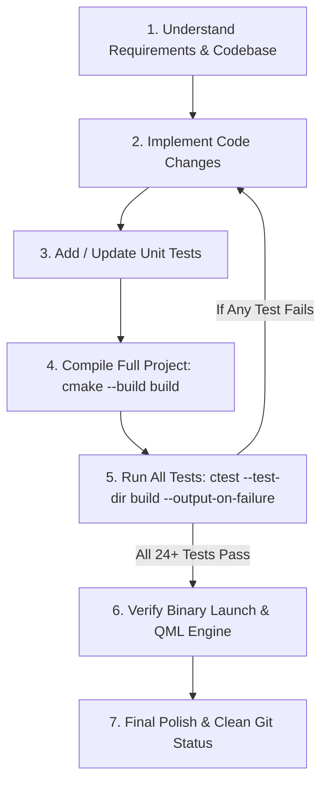

# AGENTS.md — Developer & AI Agent Guide for WaveFlux

Welcome to **WaveFlux**! This document serves as the primary reference, architectural guide, and operational protocol for AI Agents (and human developers) working on the WaveFlux codebase.

---

## 1. Project Overview & Tech Stack

**WaveFlux** is a modern, high-performance, cross-platform audio player written in modern C++ (C++20) and Qt 6 / QML.

- **Language & Standards**: C++20, Qt 6.5+, QML (Qt Quick / Qt Quick Controls 2), Kirigami (KDE Frameworks 6).
- **Build System**: CMake (minimum 3.16) with `qt_add_qml_module`.
- **Audio Engines**:
  - **GStreamer 1.0**: Primary pipeline for standard audio playback (FLAC, MP3, AAC, OGG, Opus, WAV, ALAC, DSD, CUE sheets, streaming).
  - **libopenmpt / TrackerPcmEngine**: Native tracker engine for module formats (MOD, XM, S3M, IT, UMX, etc.).
- **Tagging & Metadata**: TagLib.
- **Database & Storage**: SQLite (`QSqlDatabase`) for smart collections, search indexes, and caching.
- **Conversion & Ingestion**: Integrated FFmpeg converter pipeline and yt-dlp downloader services.

---

## 2. Mandatory Rules & Verification Workflow

Every AI Agent modifying this repository **MUST** strictly adhere to the following workflow for all feature additions, refactorings, and bug fixes:



### 🔴 Core Requirements

1. **All Unit Tests Must Pass**:
   - After making changes, run `ctest --test-dir build --output-on-failure`.
   - **100% of tests must pass** before considering a task complete. Zero failures allowed.
2. **Create Unit Tests for New Features & Bug Fixes**:
   - Every newly added feature or fixed regression must have corresponding test coverage in `tests/tst_*.cpp`.
3. **Verify Application Launch**:
   - Build artifacts must be verified at runtime. Always ensure `./build/waveflux` executes and loads QML components without errors (e.g. run `./build/waveflux --help` and verify no QML `type unavailable` or `Cannot assign to non-existent property` errors occur during component initialization).
4. **Preserve Comments & Docstrings**:
   - Retain existing code comments, docstrings, and diagnostic traces unless explicitly instructed otherwise.
5. **Always Register New QML Files in CMake**:
   - Whenever creating a new `.qml` file in `qml/` or `qml/components/`, **immediately add it to `CMakeLists.txt` under `QML_FILES`**. Qt 6 QML modules will fail to find or bundle any file omitted from `CMakeLists.txt`.

---

## 3. Architecture & Codebase Map

### Directory Structure

```
waveflux/
├── CMakeLists.txt              # Root CMake configuration & QML module setup
├── AGENTS.md                   # This instruction file for AI agents
├── resources/                  # App icons, SVG themed assets, icons.qrc
├── src/                        # Core C++ business logic & backend services
│   ├── main.cpp                # Application entry point, CLI parser, DI wiring
│   ├── AudioEngine.h/.cpp      # GStreamer audio pipeline & playback backend
│   ├── PlaybackController.h/.cpp# Queue, repeat (including A-B fragment loop), shuffle, transitions
│   ├── TrackModel.h/.cpp       # Playlist model, sorting, searching, CUE support
│   ├── AppSettingsManager.h/.cpp# Persistent settings, QSettings sync, localization (EN/RU)
│   ├── ShortcutRegistry.h/.cpp # Keybindings, configurable action shortcuts
│   ├── SessionManager.h/.cpp   # State restoration (position, queue, active track)
│   ├── WaveformItem.h/.cpp     # Custom Qt Quick visual waveform renderer
│   ├── WaveformProvider.h/.cpp # Background peak extraction & waveform cache
│   ├── AudioConverterService.* # Track format transcoders (FFmpeg)
│   ├── BatchAudioConverterService.* # Batch audio processing engine & queue
│   ├── YtDlpImportService.*    # URL downloader & metadata extractor
│   ├── library/                # SQLite database repository, smart collections
│   └── playback/               # OpenMPT tracker backend & backend routing
├── qml/                        # QML UI views and dialogs
│   ├── Main.qml                # Main window layout, actions, menu bar, global shortcuts
│   ├── CompactSkin.qml         # Compact player skin / mini-mode
│   ├── WaveformView.qml        # Interactive waveform, seek, zoom, A-B loop bars & overlay
│   ├── PlaylistView.qml        # Playlist UI, drag-and-drop, context menus
│   ├── PlayerControls.qml      # Play/pause/next/prev controls, volume, progress
│   ├── SettingsDialog.qml      # Full preferences dialog (Audio, UI, Shortcuts, etc.)
│   ├── FragmentRepeatDialog.qml# A-B Fragment repeat loop configuration dialog
│   ├── EqualizerDialog.qml     # Graphic equalizer dialog & presets
│   ├── AudioConverterDialog.qml# Single track converter dialog
│   ├── BatchAudioConverterDialog.qml # Batch conversion manager dialog
│   ├── SmartCollectionDialog.qml# Smart playlist rule builder
│   ├── OpenUrlDialog.qml       # Network URL / stream input dialog
│   ├── UpdateAvailableDialog.qml# Update notifier dialog
│   ├── TagEditorDialog.qml     # Metadata editor dialog
│   ├── BulkTagEditorDialog.qml # Multi-track batch tag editor
│   └── components/             # Reusable UI widgets and design tokens
│       ├── AppDialog.qml       # Universal dialog wrapper (windowed vs embedded modal)
│       ├── Button.qml          # Standard button with accent/flat states
│       ├── AccentSwitch.qml    # Toggle switch
│       ├── AccentCheckBox.qml  # Checkbox
│       ├── AccentSlider.qml    # Slider
│       ├── AccentMenu.qml      # Context menu container
│       ├── AccentMenuItem.qml  # Context menu item (uses icon.source / icon.color)
│       ├── SettingToggleRow.qml# Setting row with title, toggle & search filter
│       ├── SettingSliderRow.qml# Setting row with slider & readout
│       └── HeaderBar.qml, ControlBar.qml, PlaylistTable.qml, etc.
└── tests/                      # QtTest unit test suites
    ├── CMakeLists.txt          # Test targets & registration
    ├── tst_AppSettingsManager.cpp
    ├── tst_PlaybackControllerScenarios.cpp
    ├── tst_PlaybackControllerTransitions.cpp
    ├── tst_AudioConverterService.cpp
    ├── tst_BatchAudioConverterService.cpp
    ├── tst_EqualizerPresetManager.cpp
    ├── tst_YtDlpImportService.cpp
    ├── tst_AppDialog.cpp
    └── ... (24+ test suites total)
```

---

## 4. Key Subsystems & Coding Guidelines

### 4.1 Playback State & Fragment Repeat (A-B Loop)
- **Fragment Repeat Mode**: Allows looping a specific portion of a track `[fragmentStartMs, fragmentEndMs]`.
- Implemented in [`PlaybackController`](file:///home/leo/Projects/audioplayer/waveflux/src/PlaybackController.h):
  - Forward playback: when `positionMs >= fragmentEndMs`, seeks to `fragmentStartMs`.
  - Reverse playback: when `positionMs <= fragmentStartMs`, seeks to `fragmentEndMs`.
  - End of Stream (EOS): loops back to start rather than advancing track.
  - Per-track persistence: when `persistFragmentLoopPerTrack` is enabled, loops are saved/restored across track switches.
- Controlled via Waveform right-click menu, draggable A/B bars in `WaveformView.qml`, global shortcuts (`Ctrl+[`, `Ctrl+]`, `Alt+L`, `Ctrl+Shift+L`), and `FragmentRepeatDialog.qml`.

### 4.2 Dialogs & Window Management
- All modal and auxiliary dialogs use [`AppDialog.qml`](file:///home/leo/Projects/audioplayer/waveflux/qml/components/AppDialog.qml).
- Supports dual modes:
  1. **Separate top-level window** (when `appSettings.separateWindowDialogs` is true or platform requests it).
  2. **In-window modal overlay** (when running embedded).
- **Rules for Dialogs**:
  - Always provide `implicitWidth` and `implicitHeight`.
  - Ensure contents inside `contentItem` use `ScrollView` with `contentWidth: availableWidth` so dialogs never overflow vertically on smaller screens or after window resizing.
  - Interactive elements inside dialogs should have responsive layouts using `ColumnLayout` / `RowLayout` rather than fixed absolute widths.

### 4.3 Localization & Settings
- Settings are managed centrally by [`AppSettingsManager`](file:///home/leo/Projects/audioplayer/waveflux/src/AppSettingsManager.h).
- Supports English (`en`) and Russian (`ru`).
- When adding new UI strings:
  1. Add translations in `AppSettingsManager::loadTranslations()` for both languages.
  2. Access strings in QML via `root.tr("section.key")` or `appSettings.translate("section.key")`.

### 4.4 Shortcuts & Actions
- Shortcuts are registered in [`ShortcutRegistry.cpp`](file:///home/leo/Projects/audioplayer/waveflux/src/ShortcutRegistry.cpp).
- Standard actions are declared in `Main.qml` with `objectName: "category.actionName"`.

### 4.5 QML Component & Icon Conventions
- **Emoji and Unicode pictograms are prohibited in the application UI.** Never use emoji, transport glyphs, stars, musical-note characters, or other font-rendered symbols as buttons, status markers, placeholders, or decorative icons.
- All action, status, navigation, and placeholder icons must use Breeze-compatible SVG assets through `IconResolver.themed("icon-name", themeManager.darkMode)`. Plain Unicode is allowed only when it is actual textual content (for example, mathematical notation), not as an icon substitute.
- Use `IconResolver.themed("icon-name", themeManager.darkMode)` for icon URLs.
- In `AccentMenuItem`, set `icon.source` and `icon.color` (do **not** use `iconSource`).
- Use custom components from `qml/components/` (`Button`, `AccentSwitch`, `AccentSlider`, `AccentComboBox`, etc.) rather than unstyled stock controls to maintain visual harmony.

---

## 5. Build, Test, & Execution Commands

### Configure & Build
```bash
# Configure with CMake (Debug or RelWithDebInfo recommended for dev)
cmake -B build -S . -DCMAKE_BUILD_TYPE=RelWithDebInfo

# Build all targets (application and unit tests)
cmake --build build -j$(nproc)
```

### Run Unit Tests
```bash
# Run all test suites with verbose output on failures
ctest --test-dir build --output-on-failure

# Run a specific test suite
ctest --test-dir build -R tst_playback_controller_scenarios --output-on-failure
```

### Smoke Test Main Binary
```bash
# Verify CLI help output & binary execution
./build/waveflux --help

# Verify reverse playback flag
./build/waveflux --help-all
```

---

## 6. Checklist for AI Agents Before Submitting Work

- [ ] Implemented feature / fix cleanly in C++ or QML following existing conventions.
- [ ] If a new `.qml` file was created, registered it in `CMakeLists.txt` under `QML_FILES`.
- [ ] Added / updated unit tests covering the new functionality.
- [ ] Compiled the entire project with `cmake --build build -j$(nproc)` without errors or warnings.
- [ ] Ran `ctest --test-dir build --output-on-failure` and confirmed **100% of tests passed**.
- [ ] Verified that `./build/waveflux` executes without QML runtime errors or missing type warnings.
- [ ] Maintained all existing comments and documentation integrity.
