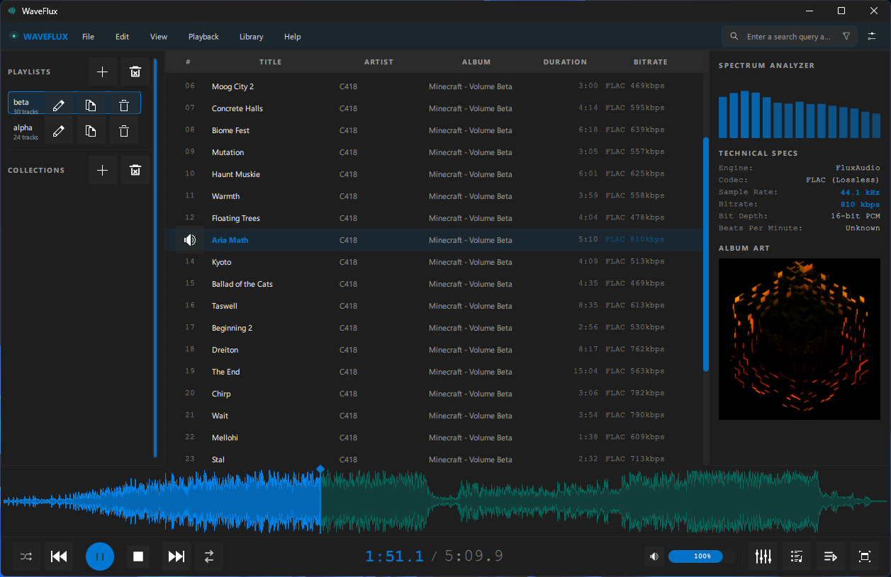
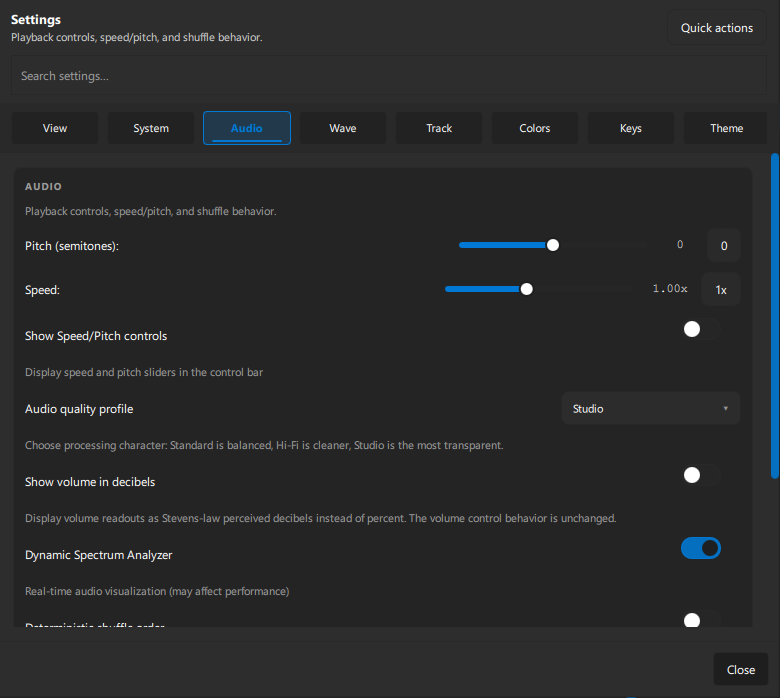
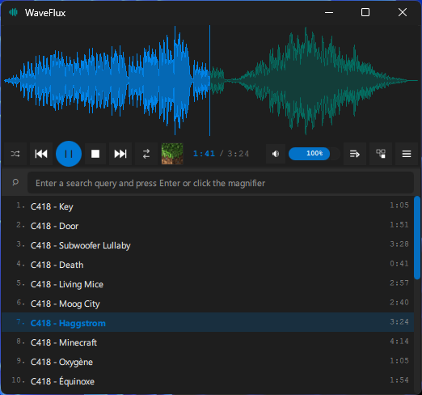

# WaveFlux

[](#)
[](#)
[](https://www.qt.io/)
[](https://gstreamer.freedesktop.org/)
[](https://sqlite.org/)
[](https://cmake.org/)
[](#)
[](#)

WaveFlux is a desktop audio player built with Qt 6, Kirigami, GStreamer, and libopenmpt.
It targets local-library playback with waveform-driven navigation, playlist-heavy workflows,
metadata editing, and first-class tracker module support on both Linux and Windows.

## Screenshots

<div align="center">

| Main Player | Settings | Compact Skin |
|:-----------:|:--------:|:------------:|
|  |  |  |

</div>

## Features

- **Waveform UI** — scrubbing, zoom, cached peaks, fullscreen waveform mode
- **Tracker module playback** — `.mod`, `.xm`, `.s3m`, `.it`, `.669` via libopenmpt with stable seek, waveform, spectrum, equalizer, and session restore
- **Gapless playback** — queue, repeat, deterministic shuffle, and session restore
- **Playback controls** — speed, pitch, reverse, seek, and audio quality profiles (backend-dependent)
- **10-band equalizer** — built-in presets, user preset import/export
- **Playlist ingest** — files, folders, drag-and-drop, URLs, XSPF, CUE sheets
- **Playlist export** — M3U, M3U8, JSON
- **yt-dlp integration** — URL import with format selection, retries, and import reports
- **Audio converter** — format/profile validation, pitch/speed controls, playlist insertion; single-track and batch modes
- **Tag editor** — single-track and bulk editing with cover art support
- **Smart collections** — persistent library and field-aware search backed by SQLite
- **Playlist profiles** — save, restore, duplicate, and delete named playlist snapshots
- **Update checker** — GitHub Releases integration with optional automatic background checks
- **Performance profiler** — overlay, memory checkpoints, JSON/CSV export, memory-budget tooling
- **Desktop integration** — SMTC on Windows, MPRIS/XDG portal on Linux
- **UI languages** — English and Russian
- **Layout modes** — normal and compact

## Platform Support

| Feature | Linux | Windows |
|---------|-------|---------|
| Native build | Qt/Kirigami | `waveflux.exe` with embedded icon |
| Desktop integration | MPRIS, XDG portal | Windows System Media Transport Controls |
| Packaging | AppImage, Debian, RPM, Arch | Portable ZIP, MSI (WiX 6) |

## Technology Stack

- **Language:** C++20
- **UI:** Qt 6.5 (Core, Quick, QML, GUI, Multimedia, SQL, Concurrent, Widgets, QuickControls2), KDE Frameworks 6 (Kirigami, CoreAddons, I18n)
- **Audio:** GStreamer 1.0 (`gstreamer-1.0`, `gstreamer-app-1.0`, `gstreamer-audio-1.0`), libopenmpt
- **Metadata:** TagLib
- **Library/search:** SQLite
- **Build:** CMake 3.21+, Ninja (recommended)
- **Linux-only:** Qt DBus (`WAVEFLUX_ENABLE_DBUS_INTEGRATION=ON`)

## Repository Layout

```
src/            C++ backend
src/library/    SQLite library, search, and smart-collection backend
src/playback/   Tracker and PCM playback backends
qml/            QML/Kirigami UI
qml/components/ Reusable UI components
tests/          Qt test targets
scripts/        Build, deploy, packaging, and memory-budget helpers
packaging/      Distro packaging assets and WiX sources
resources/      Icons and application resources
screenshots/    README screenshots
```

## Build Requirements

- C++20 compiler (GCC 11+ or MSVC 2022+)
- CMake 3.21+, Ninja (recommended)
- `pkg-config` / `pkgconf`
- Qt 6.5+ development packages (Core, Quick, QML, GUI, Multimedia, SQL, Concurrent, Widgets, QuickControls2)
- KDE Frameworks 6 (Kirigami, CoreAddons, I18n)
- GStreamer 1.0 development packages
- libopenmpt development package
- TagLib development package

## Linux Build

Install dependencies on Arch Linux:

```bash
sudo pacman -S --needed \
  cmake ninja gcc pkgconf \
  qt6-base qt6-declarative qt6-multimedia qt6-quickcontrols2 \
  kirigami kcoreaddons ki18n \
  gstreamer gst-plugins-base gst-plugins-good gst-plugins-bad \
  libopenmpt taglib
```

Optional codec pack (MP3 encoding):

```bash
sudo pacman -S --needed gst-plugins-ugly
```

Install dependencies on Debian/Ubuntu:

```bash
sudo apt install -y \
  build-essential cmake ninja-build pkgconf \
  qt6-base-dev qt6-declarative-dev qt6-multimedia-dev \
  extra-cmake-modules libkirigami-dev libkf6coreaddons-dev libkf6i18n-dev \
  libgstreamer1.0-dev libgstreamer-plugins-base1.0-dev \
  libopenmpt-dev libtag-dev
```

Configure and build:

```bash
cmake -S . -B build -G Ninja -DCMAKE_BUILD_TYPE=Release
cmake --build build
./build/waveflux
```

Optional local install:

```bash
cmake --install build --prefix ~/.local
```

## Windows Build

Uses a PowerShell helper that sets up the MSYS2 UCRT64 runtime so Qt tools (`moc`, `rcc`, `qmlcachegen`, `windres`) resolve correctly.

Build:

```powershell
powershell -NoProfile -ExecutionPolicy Bypass -File .\scripts\build-win-runtime.ps1
```

Build and run tests:

```powershell
powershell -NoProfile -ExecutionPolicy Bypass -File .\scripts\build-win-runtime.ps1 -RunTests
```

Output: `build-win-runtime\waveflux.exe`

## Tests

```bash
# All tests
ctest --test-dir build --output-on-failure

# Subset by name pattern
ctest --test-dir build -R tst_playback --output-on-failure

# Run a test binary directly
./build/tests/tst_PlaybackControllerScenarios
```

Test targets:

| Target | Covers |
|--------|--------|
| `tst_equalizer_preset_manager` | EQ preset load/save/import/export |
| `tst_cue_sheet_parser` | CUE sheet parsing |
| `tst_xspf_playlist_parser` | XSPF playlist parsing |
| `tst_app_settings_manager` | Settings persistence |
| `tst_update_checker` | GitHub Releases update check |
| `tst_ytdlp_import_service` | yt-dlp import pipeline |
| `tst_ytdlp_import_dialog_smoke` | Import dialog QML smoke |
| `tst_playback_backend_contract` | Backend capability contract |
| `tst_openmpt_playback_backend` | OpenMPT playback |
| `tst_openmpt_waveform_renderer` | Tracker waveform rendering |
| `tst_waveform_provider` | Waveform peak generation |
| `tst_playback_backend_routing` | Format-to-backend routing |
| `tst_playback_controller_transitions` | Gapless transition logic |
| `tst_playback_controller_scenarios` | Playlist playback scenarios |
| `tst_audio_converter_qml_smoke` | Converter dialog QML smoke (requires `qmllint`) |
| `tst_remote_tracker_source_cache` | Remote tracker download cache |
| `tracker_dsp_bench` | DSP benchmark (not a CTest target) |

## Tracker Module Playback

WaveFlux treats supported tracker formats as a first-class playback path via libopenmpt, not a fallback.

**Supported:** `.669`, `.mod`, `.xm`, `.s3m`, `.it` — local files, `file://`, and remote `http(s)://` URLs (downloaded to a local cache before decode).

**Capabilities:** stable play/pause/stop/resume, direct seek, waveform scrubbing, offline waveform rendering, spectrum analyzer, 10-band equalizer, near-gapless tracker-to-tracker preload, session restore, and tracker metadata (type, channels, patterns, instruments, internal song message).

**Intentional limitations:**
- Near-gapless transitions, not true seamless shared-sink handoff
- Reverse playback, rate changes, time-stretch, pitch, and pitch-shift are disabled — use the audio converter to render to a standard format first
- `.ahx`, `.med`, `.mptm`, `.umx` and other formats outside the compatibility matrix are rejected

## Packaging

### AppImage

```bash
./scripts/build-appimage.sh
```

Output: `dist/WaveFlux-<version>-<arch>.AppImage`

Build on the oldest target distro for maximum compatibility. Offline builds can pass `--runtime-file <path>`.

### Debian

```bash
./scripts/build-debian-package.sh
```

Output: `dist/debian/waveflux_<version>-<release>_<arch>.deb`

### RPM

```bash
# With automatic build-dep install
./scripts/build-rpm-package.sh --install-build-deps
```

Output: `dist/rpm/`

### Arch

```bash
./scripts/build-pacman-package.sh --syncdeps
```

Output: `dist/pacman/`

### Windows Portable ZIP

```powershell
powershell -NoProfile -ExecutionPolicy Bypass -File .\scripts\build-portable-zip.ps1
```

Output: `dist/windows/WaveFlux-<version>-windows-portable.zip`

### Windows MSI Installer

Requires [WiX Toolset 6](https://wixtoolset.org/).

```powershell
powershell -NoProfile -ExecutionPolicy Bypass -File .\scripts\build-wix-installer.ps1
```

Output: `dist/windows/WaveFlux-<version>-windows-x64.msi`

### Release Asset Naming

Asset names are stable by contract — the in-app update checker uses them to recommend the right download:

```
WaveFlux-<version>-windows-portable.zip
WaveFlux-<version>-windows-x64.msi
WaveFlux-<version>-<arch>.AppImage
waveflux_<version>-<release>_<arch>.deb
```

## Keyboard Shortcuts

| Shortcut | Action |
|----------|--------|
| `Space` | Play / pause |
| `Ctrl+O` | Open files |
| `Ctrl+Shift+O` | Add folder |
| `Ctrl+E` | Export playlist |
| `Ctrl+Shift+G` | Equalizer |
| `F1` | Keyboard shortcuts dialog |
| `F11` | Fullscreen |

## Search Syntax

The search bar supports field-aware tokens:

```
title:night
artist:massive attack
album:mezzanine
path:/music/live
is:lossless
is:hires
```

## Updates

WaveFlux checks for new releases at <https://github.com/leocallidus/waveflux/releases>.

Automatic checks are on by default and can be toggled in **Settings → System → Automatically check for updates**. The updater only reads release metadata — it never downloads or executes release assets. Update checks do not transmit library contents, file paths, playlists, or user settings.

## Performance and Memory Tooling

Enable runtime profiling:

```bash
WAVEFLUX_PROFILE=1 ./build/waveflux
```

Run memory budget validation:

```powershell
powershell -NoProfile -ExecutionPolicy Bypass -File .\scripts\check-memory-budgets.ps1
```

Diagnostic environment variables:

| Variable | Effect |
|----------|--------|
| `WAVEFLUX_SEEK_DIAG=1` | Verbose seek tracing |
| `WAVEFLUX_DETAILED_DIAG=1` | Detailed playback diagnostics |
| `WAVEFLUX_TRANSITION_TRACE=1` | Gapless transition trace |
| `WAVEFLUX_TRACKER_DIAG=1` | Tracker preload and promotion counters |
| `WAVEFLUX_PROFILE=1` | Performance profiler overlay |

## Troubleshooting

**No audio output for tracker playback** — verify Qt Multimedia sees a working output device. On Linux, ensure PipeWire or PulseAudio is running. If standard formats also fail, fix the system output device first.

**Equalizer unavailable** — install the GStreamer equalizer plugin, typically in `gst-plugins-good` or `gst-plugins-bad`.

**Waveform failed for a tracker module** — waveform rendering uses a separate offline decode path; a failure there does not affect realtime playback. Corrupt or remote-source modules may produce a placeholder.

**Gapless degraded to near-gapless** — expected for tracker modules. Enable `WAVEFLUX_TRACKER_DIAG=1` to inspect preload and transition latency counters.

**Tray icon disabled** — your desktop session may not expose a system tray host.

**Windows build tools fail** — use the provided PowerShell scripts; invoking Qt/MSYS2 tools from an unprepared shell will not work.

## Notes

- Cover art editing depends on format support; WAV files do not support embedded cover art.
- Portable ZIP builds use normal app-data locations for settings and cache despite being no-install bundles.
- Windows taskbar icons may appear stale after icon changes until the shell cache or pinned shortcuts are refreshed.

## License

[MIT](LICENSE)
