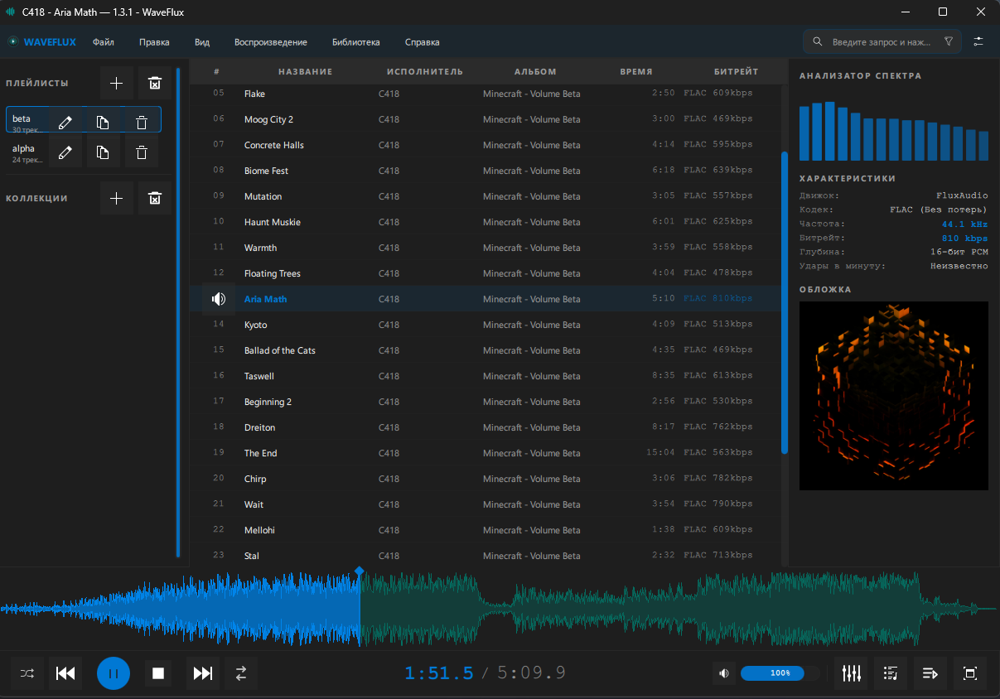
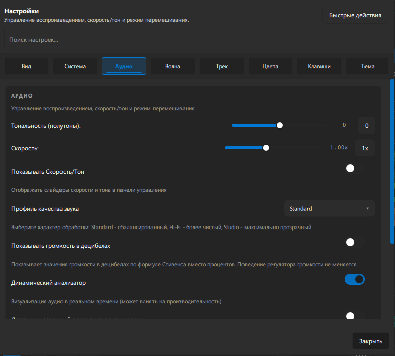
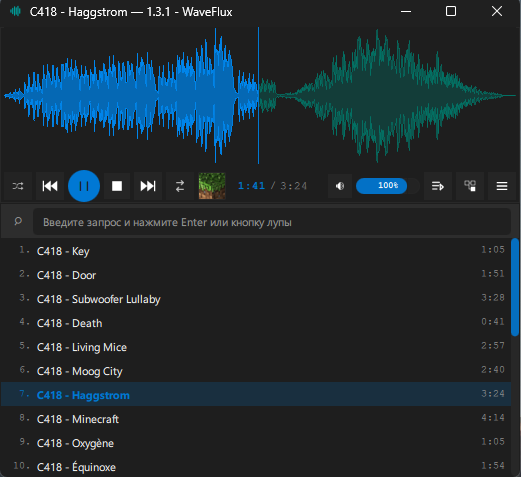

# WaveFlux

[](#)
[](#)
[](https://www.qt.io/)
[](https://gstreamer.freedesktop.org/)
[](https://sqlite.org/index.html)
[](https://cmake.org/)
[](#)
[](#)


WaveFlux is a desktop audio player built with Qt 6, Kirigami, GStreamer, and TagLib.
It is focused on local-library playback, waveform-driven navigation, playlist-heavy workflows,
metadata editing, and desktop integration on both Windows and Linux.


## Highlights

- Waveform-first playback UI with scrubbing, zoom, cached peaks, and fullscreen waveform mode
- Gapless playback flow with queue, repeat, deterministic shuffle, and session restore
- Native OpenMPT tracker playback for `.mod`, `.xm`, `.s3m`, and `.it` with stable seek, waveform, spectrum, equalizer, and session restore
- Playback controls for speed, pitch, reverse playback, seek, and audio quality profiles where the active backend supports them
- 10-band equalizer with built-in presets plus user preset import/export
- Playlist ingest from files, folders, drag-and-drop, URLs, XSPF, and CUE sheets
- Playlist export to M3U, M3U8, and JSON
- Audio import from URL with `yt-dlp` probing, format selection, output planning, retries, and import reports
- Built-in audio converter for local tracks, including format/profile validation, pitch/speed controls, and playlist insertion
- Single-track and bulk tag editing with cover art support where the format allows it
- Smart collections and persistent library/search backend using SQLite
- Saved playlist profiles with restore, update, duplicate, and delete flows
- Built-in performance profiler with overlay, memory checkpoints, JSON/CSV export, and memory-budget tooling
- Windows media integration via SMTC and Linux desktop integration via MPRIS/XDG portal when enabled
- English and Russian UI
- Normal and compact interface modes

## Platform Support

### Windows

- Native `waveflux.exe` build with embedded application icon
- Windows System Media Transport Controls integration
- Portable ZIP packaging
- MSI installer packaging via WiX Toolset 6

### Linux

- Native Qt/Kirigami desktop build
- MPRIS integration over D-Bus
- XDG portal file picker support when D-Bus integration is enabled
- AppImage, Debian, RPM, and Arch packaging helpers

## Technology Stack

- C++20
- Qt 6.5: Core, Quick, QML, GUI, Multimedia, SQL, Concurrent, Widgets, Test, QuickControls2
- Qt DBus on Linux when `WAVEFLUX_ENABLE_DBUS_INTEGRATION=ON`
- KDE Frameworks 6: Kirigami, CoreAddons, I18n
- GStreamer 1.0: `gstreamer-1.0`, `gstreamer-app-1.0`, `gstreamer-audio-1.0`
- libopenmpt: `libopenmpt`
- TagLib
- SQLite
- CMake 3.21+

## Repository Layout

- `src/` - C++ backend
- `src/library/` - SQLite library/search/smart-collection backend
- `qml/` - QML and Kirigami UI
- `tests/` - Qt test targets
- `scripts/` - build, deploy, packaging, and memory-budget helpers
- `packaging/` - distro packaging assets and WiX sources
- `resources/icons/` - application icons

## Screenshots

<div align="center">

| Main Player Window | Setting Dialog | Compact Skin |
|:---------:|:--------:|:-----------:|
|  |  |  |

</div>

## Build Requirements

At minimum:

- C++20 compiler
- `cmake` 3.21 or newer
- `ninja` recommended
- `pkg-config` / `pkgconf`
- Qt 6 development packages
- KDE Frameworks 6 development packages
- GStreamer development packages
- libopenmpt development package
- TagLib development package
- Qt Multimedia development package

## Linux Build

Arch Linux reference install:

```bash
sudo pacman -S --needed \
  cmake ninja gcc pkgconf \
  qt6-base qt6-declarative qt6-multimedia qt6-quickcontrols2 \
  kirigami kcoreaddons ki18n \
  gstreamer gst-plugins-base gst-plugins-good gst-plugins-bad \
  libopenmpt taglib
```

Optional codec/plugin pack:

```bash
sudo pacman -S --needed gst-plugins-ugly
```

Audio converter runtime note:

- baseline converter formats on Linux are expected to work when `gst-plugins-base` and `gst-plugins-good` are installed;
- MP3 encoding may additionally require `gst-plugins-ugly` or distro-specific LAME packaging because `lamemp3enc` is not guaranteed in every default install;
- if a required encoder or muxer plugin is missing, WaveFlux now shows that format as unavailable in the converter UI instead of advertising it as fully ready.

Generic build:

```bash
cmake -S . -B build -G Ninja -DCMAKE_BUILD_TYPE=Release -DBUILD_TESTING=ON
cmake --build build
./build/waveflux
```

Optional local install:

```bash
cmake --install build --prefix ~/.local
```

## Windows Build

WaveFlux uses a dedicated Windows runtime build flow. The helper script sets up the MSYS2 UCRT64 runtime in `PATH`
so Qt tools like `moc`, `rcc`, `qmlcachegen`, and `windres` can run reliably.

Build runtime bundle:

```powershell
powershell -NoProfile -ExecutionPolicy Bypass -File .\scripts\build-win-runtime.ps1
```

Build and run tests:

```powershell
powershell -NoProfile -ExecutionPolicy Bypass -File .\scripts\build-win-runtime.ps1 -RunTests
```

Re-run tests without another deploy step:

```powershell
powershell -NoProfile -ExecutionPolicy Bypass -File .\scripts\build-win-runtime.ps1 -SkipBuild -RunTests
```

Windows converter runtime note:

- `scripts/deploy-windows-runtime.ps1` bundles the converter-focused GStreamer plugin subset, including `libgstlame`, `libgstwavenc`, `libgstflac`, `libgstopus`, and `libgstogg`;
- if a runtime build intentionally omits one of those plugins, the corresponding format appears as unavailable in the converter UI instead of failing only at start time.

Default runtime output:

- [`build-win-runtime/waveflux.exe`]

## Tests

Run test suite from an existing build:

```bash
ctest --test-dir build --output-on-failure
```

Current test targets:

- `tst_equalizer_preset_manager`
- `tst_cue_sheet_parser`
- `tst_xspf_playlist_parser`
- `tst_app_settings_manager`
- `tst_ytdlp_import_service`
- `tst_ytdlp_import_dialog_smoke`
- `tst_playback_backend_contract`
- `tst_openmpt_playback_backend`
- `tst_openmpt_waveform_renderer`
- `tst_waveform_provider`
- `tst_playback_backend_routing`
- `tst_playback_controller_transitions`
- `tst_playback_controller_scenarios`
- `tst_audio_converter_qml_smoke`

Tracker release validation also uses:

- `tst_remote_tracker_source_cache`
- `tracker_dsp_bench`

## Tracker Modules

WaveFlux treats supported tracker modules as a first-class OpenMPT playback path instead of a reduced fallback mode.

Current tracker support:

- local files and `file://` URLs for `.669`, `.mod`, `.xm`, `.s3m`, and `.it`;
- remote `http://` and `https://` tracker URLs after controlled download into a local cache file;
- stable play, pause, stop, resume, direct seek, repeated seek, waveform scrubbing, and session restore;
- offline waveform rendering from a dedicated OpenMPT renderer path;
- tracker spectrum analyzer and 10-band equalizer through the OpenMPT PCM pipeline;
- near-gapless tracker-to-tracker preload and promotion;
- tracker metadata for type, channels, patterns, instruments, and internal song message when available;
- structured tracker runtime diagnostics through opt-in `[TrackerDiag]` logs and debug snapshots.

Still intentionally limited for tracker playback:

- gapless is near-gapless, not true seamless shared-output handoff;
- reverse playback, playback-rate changes, time-stretch, pitch, and pitch-shift are intentionally disabled for tracker modules;
- use the audio converter when a tracker module needs to be rendered into an ordinary audio format before further processing;
- the right info panel hides sample rate, bitrate, bit depth, and BPM for tracker modules because these values are not reliable module-file properties;
- tracker audio quality profile stays `standard`;
- tracker formats outside the compatibility matrix remain unsupported even if libopenmpt can decode some of them.

## Troubleshooting

### No audio output for tracker playback

- Verify that Qt Multimedia sees a working default output device on the host. In headless CI and some sandboxed sessions there is no usable PulseAudio/PipeWire device, so playback tests that need a real sink can fail or skip.
- On Linux, make sure PipeWire or PulseAudio is running before starting WaveFlux.
- If ordinary formats also produce no sound, this is not an OpenMPT-specific failure. Fix the system output device first.

### Waveform failed for a tracker module

- Waveform rendering uses a separate offline OpenMPT decode path. A waveform failure does not mean the realtime playback engine crashed.
- Corrupt or truncated modules can fail waveform generation and still surface as a controlled placeholder state in the UI.
- If the module came from a remote URL, wait for the download phase to finish first. The waveform job runs against the cached local copy, not against the network stream.

### Tracker transport DSP unavailable

- This is expected for tracker modules. WaveFlux v3 intentionally reports `reverse=false`, `rate=false`, `timeStretch=false`, `pitch=false`, and `pitchShift=false` for the OpenMPT backend.
- Use the audio converter to render a tracker module into an ordinary audio format when speed or pitch processing is needed outside tracker playback.
- No extra SoundTouch package is required for tracker playback.

### Gapless degraded to near-gapless

- WaveFlux v3 ships measured near-gapless tracker transitions, not true seamless shared-sink handoff.
- Tracker-to-tracker transitions can preload the next module and promote it at EOS. Mixed tracker/ordinary transitions use reliable backend switching.
- Enable `WAVEFLUX_TRACKER_DIAG=1` to inspect preload, promotion, and gapless transition latency counters.

### Device-loss recovery failed

- A missing or disconnected output device should produce a controlled error or paused safe-stop, not a stuck `Playing` state.
- On Linux, verify PipeWire or PulseAudio is running and exposes a default output to Qt Multimedia.
- On Windows, repeat the default-device switch with the packaged runtime and check whether the device appears in system sound settings.
- Use tracker diagnostics fields such as `audioDeviceLossCount`, `audioDeviceReopenCount`, recovery counters, and `lastAudioDeviceStatus` to distinguish no-device from recovery failure.

### Unsupported tracker module

- Known unsupported tracker candidates such as `.ahx`, `.med`, `.mptm`, and `.umx` are rejected before playback until they have fixtures and regression coverage.
- A tracker-looking file that OpenMPT rejects does not fall back to the old GStreamer tracker path.

## Packaging

### Windows Portable ZIP

```powershell
powershell -NoProfile -ExecutionPolicy Bypass -File .\scripts\build-portable-zip.ps1
```

Optional flags:

- `-RunTests`
- `-SkipBuild`
- `-SkipZip`

Output:

- `dist/windows/WaveFlux-<version>-windows-portable.zip`

### Windows MSI Installer

Requires WiX Toolset 6.

```powershell
powershell -NoProfile -ExecutionPolicy Bypass -File .\scripts\build-wix-installer.ps1
```

Optional flags:

- `-RunTests`
- `-SkipBuild`
- `-WixExe <path-to-wix.exe>`

Output:

- `dist/windows/WaveFlux-<version>-windows-x64.msi`

Generated intermediate WiX sources:

- `dist/windows/wix/WaveFlux-<version>/`

### AppImage

```bash
./scripts/build-appimage.sh
```

The AppImage helper bundles WaveFlux runtime libraries, Qt plugins, QML imports,
and GStreamer plugins into `AppDir` before packaging. For maximum compatibility
across distributions, build the AppImage on the oldest target distro you intend
to support.

Output:

- `dist/WaveFlux-<version>-<arch>.AppImage`

### Debian Package

```bash
./scripts/build-debian-package.sh
```

If build dependencies are missing:

```bash
sudo apt update
sudo apt install -y \
  build-essential cmake ninja-build pkgconf \
  qt6-base-dev qt6-declarative-dev qt6-multimedia-dev \
  extra-cmake-modules libkirigami-dev libkf6coreaddons-dev libkf6i18n-dev \
  libgstreamer1.0-dev libgstreamer-plugins-base1.0-dev \
  libopenmpt-dev libtag-dev
```

Output:

- `dist/debian/`

### RPM Package

```bash
./scripts/build-rpm-package.sh
```

Or install build dependencies first:

```bash
./scripts/build-rpm-package.sh --install-build-deps
```

Output:

- `dist/rpm/`

### Arch Package

```bash
./scripts/build-pacman-package.sh --syncdeps
```

Output:

- `dist/pacman/`

## Performance and Memory Tooling

WaveFlux includes built-in profiler and memory-budget helpers.

Enable runtime profiling:

```powershell
$env:WAVEFLUX_PROFILE='1'
waveflux\build-win-runtime\waveflux.exe
```

Memory budget validation:

```powershell
powershell -NoProfile -ExecutionPolicy Bypass -File .\scripts\check-memory-budgets.ps1
```

## Usage Notes

Common shortcuts:

- `Ctrl+O` - open files
- `Ctrl+Shift+O` - add folder
- `Ctrl+E` - export playlist
- `Space` - play/pause
- `F1` - shortcuts dialog
- `F11` - fullscreen
- `Ctrl+Shift+G` - equalizer dialog

Search supports field-aware tokens and quick filters, for example:

- `title:night`
- `artist:massive attack`
- `album:mezzanine`
- `path:/music/live`
- `is:lossless`
- `is:hires`

## Notes and Limitations

- Cover editing depends on what the file format supports. For example, WAV files are not suitable for embedded cover art editing.
- On Windows, explorer/taskbar icons may appear stale after icon changes until shell cache or pinned shortcuts are refreshed.
- Portable ZIP builds are no-install bundles, but app settings and caches still use normal app-data locations.

## Troubleshooting

- Equalizer unavailable: install the GStreamer equalizer plugin, usually through `gst-plugins-good` or `gst-plugins-bad` depending on your distro packaging.
- AppImage build in restricted or offline environments: use `scripts/build-appimage.sh --runtime-file <path-to-runtime>`.
- Tray option disabled: your current desktop session may not expose a tray host.
- Windows build tools fail unexpectedly: use the provided PowerShell scripts rather than invoking Qt/MSYS2 tools from an unprepared shell.
