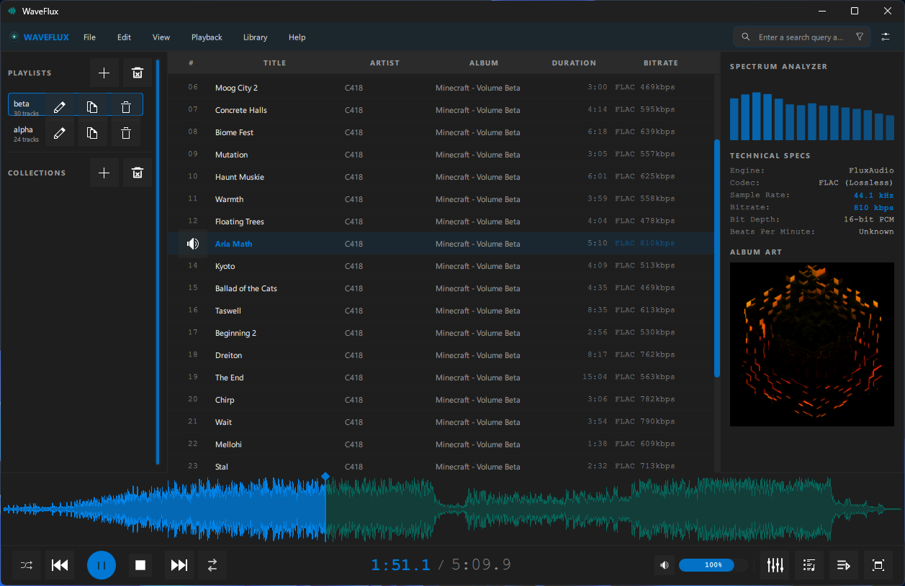
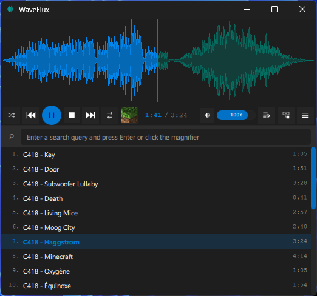
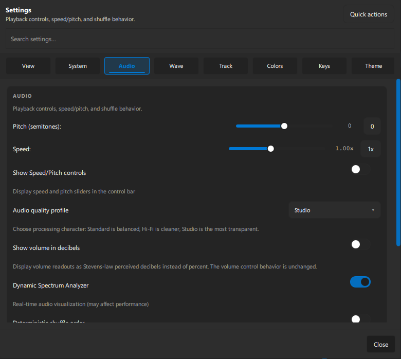

# WaveFlux

[](#)
[](#)
[](https://www.qt.io/)
[](https://gstreamer.freedesktop.org/)
[](https://sqlite.org/)
[](https://cmake.org/)
[](#)
[](#)

WaveFlux is a desktop audio player for Linux and Windows, built for local music
libraries, waveform navigation, and playlist management. It combines standard
audio playback with native tracker-module support, synchronized lyrics, metadata
editing, and audio-processing tools.

Written in C++20 with Qt Quick and KDE Kirigami, WaveFlux uses GStreamer for
standard audio and libopenmpt for supported tracker modules.

**[Download releases](https://github.com/leocallidus/waveflux/releases)** ·
**[Release notes](CHANGELOG.md)** ·
**[Report an issue](https://github.com/leocallidus/waveflux/issues)** ·
**[License](LICENSE)**



| Compact player | Settings |
| --- | --- |
|  |  |

Screenshots illustrate the available layouts; individual controls may differ
between releases.

## Contents

- [Install and start](#install-and-start)
- [Everyday use](#everyday-use)
- [Lyrics](#lyrics)
- [Audio formats and limitations](#audio-formats-and-limitations)
- [Privacy, updates, and local data](#privacy-updates-and-local-data)
- [Build from source](#build-from-source)
- [Tests and validation](#tests-and-validation)
- [Architecture](#architecture)
- [Packaging](#packaging)
- [Troubleshooting](#troubleshooting)
- [Contributing](#contributing)

## Install and start

Choose an asset for your operating system and processor architecture from the
[release page](https://github.com/leocallidus/waveflux/releases). Read its notes
for package-specific requirements. Source builds may include changes that are not
yet available in a published release.

| Platform | Package options | Getting started |
| --- | --- | --- |
| Windows | MSI installer or portable ZIP | Run the installer, or extract the entire ZIP and launch `waveflux.exe`. Keep its bundled libraries and folders alongside the executable. |
| Linux | AppImage, Debian package, RPM, or Arch package | Install a package matching your distribution, or make the AppImage executable and launch it. |

The repository contains packaging workflows for these formats; check the selected
release for its actual assets. macOS does not have a build or release workflow in
this repository. Packaged releases do not require a compiler or development tools.

For an AppImage, replace the placeholders with the downloaded filename:

```bash
chmod +x "WaveFlux-<version>-<arch>.AppImage"
./"WaveFlux-<version>-<arch>.AppImage"
```

### First playback

1. Use **File → Open Files** (`Ctrl+O`) to select audio files, or drag files onto the
   playlist. Use `Ctrl+Shift+O` to add a folder.
2. Select a track and start playback. Tap `Space` to play or pause.
3. Click the waveform to seek. Use queue and repeat controls to choose what
   plays next.
4. Open Settings to adjust the layout, language, shortcuts, and playback options.
   English and Russian are available, with standard and compact skins.

## Everyday use

### Playback and navigation

- Seek through a visual waveform with zoom and cached waveform data.
- Use repeat-one, repeat-all, shuffle, and configurable A–B fragment loops.
- Restore the playlist and playback session between launches.
- Adjust speed, tempo, and pitch where the active backend supports them. Speed
  changes use proportional pitch changes; tempo processing preserves pitch.
- Use gapless playback where supported. Tracker transitions are near-gapless
  rather than a guaranteed seamless handoff.
- Open the DSP Manager for the 10-band equalizer, volume processing, mixing and
  transitions, and silence-removal controls. Availability depends on the backend
  and installed plugins.

Reverse playback is experimental and requires a command-line opt-in; see
[Audio formats and limitations](#audio-formats-and-limitations).

### Playlists and library

- Add files, folders, direct audio URLs, playlists, and CUE sheets.
- Export playlists as M3U, M3U8, or JSON.
- Save named playlist profiles and create rule-based smart collections.
- Search titles, artists, albums, and paths, with SQLite-backed library indexing.

Search examples:

```text
title:night
artist:Massive
album:Mezzanine
path:live
is:lossless
is:hires
```

The search bar also offers field and quick-filter controls. Searching filters
displayed tracks; it does not modify the audio files.

### Editing, conversion, and imports

- Edit tags for one track or multiple selected tracks, including cover art where
  the format supports it. These actions can modify source files; keep backups
  before large metadata edits.
- Convert individual tracks or batches. Available output formats depend on the
  installed encoders and selected profile.
- Open direct audio URLs with `Ctrl+U`.
- Import audio from supported websites with `Ctrl+Shift+U` through the optional
  yt-dlp integration, including format selection and import reports.

Website imports require a working `yt-dlp` installation; FFmpeg may also be needed
for post-processing. Check executable configuration under **Settings → System &
Tools**. Standard local playback does not require yt-dlp. Only download material
you have permission to use.

### Default shortcuts

| Shortcut | Action |
| --- | --- |
| `Space` | Tap to play/pause; hold for temporary 2× speed where supported |
| `Ctrl+O` | Open files |
| `Ctrl+Shift+O` | Add a folder |
| `Ctrl+U` | Open an audio URL |
| `Ctrl+Shift+U` | Import from a website using yt-dlp |
| `Ctrl+F` | Focus playlist search |
| `Ctrl+E` | Export the playlist |
| `Ctrl+Shift+G` | Open the DSP Manager |
| `Ctrl+Alt+L` | Toggle the full Lyrics panel |
| `Ctrl+[` / `Ctrl+]` | Set the A–B loop start/end |
| `F1` | Open the keyboard-shortcut reference |
| `F11` | Toggle fullscreen |

Bindings depend on focus and the active view. Most can be customized in Settings;
the in-app shortcut reference reflects the configuration.

## Lyrics

WaveFlux displays plain lyrics and synchronized LRC lyrics. Timed lines follow
playback, highlight the current line, and can be clicked to seek. Completed lines
stay marked across verse breaks and update correctly when seeking backward.

### Choose a view

- **Full panel:** Open **View → Lyrics Panel**, use the standard-skin toolbar
  button, or press `Ctrl+Alt+L`. It is also available in the compact-skin menu and
  **Settings → Playback → Lyrics**.
- **Separate window:** Enable **Lyrics in a separate window** in the panel menu
  or Lyrics settings. Closing it hides lyrics without stopping playback. Compact
  mode uses a separate window while preserving the saved docking preference.
- **Info sidebar:** A smaller Lyrics block provides text or timed lines with
  search and refresh buttons. It is enabled by default and can be disabled
  independently under **Settings → Playback → Lyrics**.

All views share the same lyrics and playback state.

### Find or import lyrics

Online lookup is **off by default**. Enable it in Lyrics settings or the search
dialog to query LRCLIB and Lyrics.ovh. Title, artist, and, where applicable, album
and duration are sent to the provider. Local lyrics and cached results can be
used without enabling online lookup.

If automatic lookup does not find the correct song:

1. Open lyrics search and correct the title or artist. The album is optional.
2. Preview a result and select **Apply** to associate it with the track.
3. Use **Try again** to retry an online lookup, or import a local `.lrc` or `.txt`
   file from the full panel menu.

For ordinary audio files, store a matching sidecar next to the audio, such as
`song.flac` and `song.lrc`. CUE tracks use a track-specific sidecar such as
`album.track02.lrc`; timestamps must be relative to that CUE track, not the entire
backing audio file. Imports are limited to 256 KiB.

The full panel also provides timing-offset controls, copy, export, and
manual-selection management. Online coverage and availability vary. Conservative
duration matching helps avoid synchronized lyrics from the wrong recording;
manual search lets you inspect alternatives. Network failures are not cached as
“no lyrics” results.

## Audio formats and limitations

| Playback path | Formats and behavior |
| --- | --- |
| Standard audio through GStreamer | Common formats include FLAC, MP3, AAC, Ogg Vorbis, Opus, WAV, and ALAC, subject to available decoders and containers. Encoding and DSP may require additional plugins. |
| Tracker audio through libopenmpt | `.669`, `.amf`, `.dmf`, `.mod`, `.xm`, `.s3m`, and `.it`, with seeking, waveform rendering, spectrum display, and tracker metadata. Remote HTTP(S) modules are cached locally before decoding. |
| CUE sheets | Individual track navigation within a backing audio file. Seek and lyrics timing account for the selected segment. |

Tracker playback currently does not support reverse playback, time-stretching,
or pitch shifting. Explicitly unsupported tracker formats include `.ahx`, `.med`,
`.mptm`, and `.umx`. For processing unavailable on a module, render it to a
supported standard-audio format first.

To opt into experimental reverse playback for a source-built application:

```bash
./build/waveflux --enable-reverse-playback
```

This enables the feature for that session; it does not make unsupported backends
or non-seekable sources reversible.

## Privacy, updates, and local data

- **Lyrics:** Online lookup requires consent. External providers' availability
  and terms apply. Local imports and lyrics associations are stored locally.
- **Updates:** Automatic checks are enabled by default and can be disabled in
  Settings. The checker reads GitHub release metadata and directs you to a
  download; it does not automatically download or execute an installer. Update
  requests do not include library contents, playlists, local file paths, or
  application settings.
- **Remote sources:** Opening remote audio contacts its server. Website imports
  run the configured external tools.
- **Storage:** Settings use Qt's platform-native storage. Sessions, library data,
  lyrics, and caches use Qt application-data/cache locations. The Windows ZIP is
  a no-install bundle, not a mode that stores all data beside the executable.

Persisted files include `session.json`, `library/waveflux.db`, and `lyrics_cache.db`
in their respective application-data locations. Back up local state before resets
or manual deletion. Diagnostic exports may contain local paths or track metadata;
review them before sharing.

## Build from source

### Requirements

Use a consistent compiler and dependency installation for your target platform.

| Dependency | Requirement |
| --- | --- |
| Compiler | C++20 support; Linux CI uses GCC and Windows scripts use MSYS2 UCRT64 GCC |
| Build tools | CMake 3.21+, Ninja recommended, and `pkg-config`/`pkgconf` |
| Qt | Qt 6.8+ for the complete UI; Core, Network, Gui, Quick, Qml, Multimedia, Sql, Concurrent, Widgets, QuickControls2, and Test |
| KDE Frameworks | Kirigami 6, CoreAddons 6, I18n 6, and Extra CMake Modules as required by those packages |
| GStreamer | Development packages for `gstreamer-1.0`, `gstreamer-app-1.0`, and `gstreamer-audio-1.0`, plus runtime plugins |
| Metadata and tracker audio | TagLib and libopenmpt development packages with pkg-config metadata |
| Linux integration | Qt DBus, enabled by default on Linux |

**Qt version note:** CMake currently accepts Qt 6.5, but the UI uses APIs such as
`Popup.popupType` introduced in Qt 6.8. Use Qt 6.8 or newer rather than treating
successful configuration with an older version as proof of UI compatibility.
Qt Test is currently discovered even when `BUILD_TESTING=OFF`.

Clone the repository and run build commands from its root:

```bash
git clone https://github.com/leocallidus/waveflux.git
cd waveflux
```

### Linux

The [Linux CI workflow](.github/workflows/ci.yml) uses Arch Linux. An equivalent
development dependency set is:

```bash
sudo pacman -S --needed \
  base-devel cmake ninja pkgconf extra-cmake-modules \
  qt6-base qt6-declarative qt6-multimedia \
  kirigami qqc2-desktop-style breeze-icons kcoreaddons ki18n \
  gstreamer gst-plugins-base gst-plugins-good gst-plugins-bad \
  libopenmpt taglib
```

Additional plugins may be needed for particular codecs. On Debian/Ubuntu and
Fedora, install equivalent development packages from a distribution providing
Qt 6.8+ and KDE Frameworks 6. Names and availability differ by release; the
[release workflow](.github/workflows/release.yml) records dependency sets used for
Debian sid and Fedora packaging. Older distributions may not meet these requirements.

```bash
cmake -S . -B build -G Ninja \
  -DCMAKE_BUILD_TYPE=RelWithDebInfo \
  -DBUILD_TESTING=ON
cmake --build build --parallel 4
./build/waveflux
```

Adjust parallel jobs to your machine's memory and CPU capacity. For a custom
Qt/KF installation, pass `-DCMAKE_PREFIX_PATH=/path/to/prefix`.

Optional user-local installation:

```bash
cmake --install build --prefix "$HOME/.local"
```

Add `$HOME/.local/bin` to `PATH` to launch the installed `waveflux` command.

### Windows

The scripted path uses **MSYS2 UCRT64**, not mixed MSVC and MinGW libraries.
Install dependencies in an MSYS2 UCRT64 shell:

```bash
pacman -S --needed \
  git mingw-w64-ucrt-x86_64-gcc \
  mingw-w64-ucrt-x86_64-cmake mingw-w64-ucrt-x86_64-ninja \
  mingw-w64-ucrt-x86_64-pkgconf \
  mingw-w64-ucrt-x86_64-qt6-base \
  mingw-w64-ucrt-x86_64-qt6-declarative \
  mingw-w64-ucrt-x86_64-qt6-multimedia \
  mingw-w64-ucrt-x86_64-kirigami \
  mingw-w64-ucrt-x86_64-kcoreaddons mingw-w64-ucrt-x86_64-ki18n \
  mingw-w64-ucrt-x86_64-gstreamer \
  mingw-w64-ucrt-x86_64-gst-plugins-base \
  mingw-w64-ucrt-x86_64-gst-plugins-good \
  mingw-w64-ucrt-x86_64-gst-plugins-bad \
  mingw-w64-ucrt-x86_64-libopenmpt mingw-w64-ucrt-x86_64-taglib
```

Then run the helper from PowerShell in the repository root:

```powershell
powershell -NoProfile -ExecutionPolicy Bypass -File .\scripts\build-win-runtime.ps1
.\build-win-runtime\waveflux.exe
```

The helper configures the tool environment and deploys runtime dependencies.
Its default prefix is `C:\msys64\ucrt64`; use `-MsysPrefix` for another location.
To build all targets before testing, explicitly select `all`:

```powershell
powershell -NoProfile -ExecutionPolicy Bypass -File .\scripts\build-win-runtime.ps1 -Target all -RunTests
```

### Build options

| Option | Purpose |
| --- | --- |
| `BUILD_TESTING` | Build and register tests; enabled by default through CTest |
| `WAVEFLUX_ENABLE_DBUS_INTEGRATION` | Enable Linux MPRIS/XDG portal integration; on by default except on Windows |
| `WAVEFLUX_MSYS2_UCRT64_ROOT` | Windows dependency prefix for runtime deployment |
| `CMAKE_BUILD_TYPE` | Choose `Debug`, `RelWithDebInfo`, or `Release` with a single-configuration generator |

## Tests and validation

Build before testing so executables reflect your changes:

```bash
cmake --build build --parallel 4
ctest --test-dir build --output-on-failure
```

For headless Linux, install Xvfb and follow CI:

```bash
xvfb-run -a ctest --test-dir build --output-on-failure
```

Useful targeted commands:

```bash
ctest --test-dir build -N
ctest --test-dir build -R tst_lyrics --output-on-failure
ctest --test-dir build -R tst_playback --output-on-failure
./build/tests/tst_playback_controller_scenarios
./build/waveflux --help
```

Coverage includes playback, transitions, tracker backends, waveforms, settings,
metadata, conversion, lyrics, and QML. Use `ctest -N` to list targets in your build;
optional tools can affect which checks are available.

`tst_waveflux_qml_startup` launches the application and checks that it stays running
during initialization. CLI help alone does not initialize the full QML interface.
For UI changes, also exercise the affected controls, resize the window, and inspect
runtime warnings. See [lyrics validation notes](docs/LYRICS_PANEL_VALIDATION.md).

## Architecture

| Location | Responsibility |
| --- | --- |
| `src/main.cpp` | Startup, command-line options, and service wiring |
| `src/AudioEngine.*`, `src/PlaybackController.*` | Audio state, queue navigation, repeat, shuffle, and transitions |
| `src/playback/` | Backend routing, tracker PCM playback, waveform rendering, and remote-module cache |
| `src/lyrics/` | Providers, parsing, matching, cache, line model, and synchronization |
| `src/library/` | SQLite repositories, search, and smart collections |
| `src/dsp/` | Audio-processing parameters, capabilities, and processors |
| `qml/`, `qml/components/` | Main views, dialogs, and reusable themed controls |
| `qml/settings/`, `qml/dsp/` | Settings pages and DSP controls |
| `tests/` | Qt Test suites and QML/runtime smoke checks |
| `scripts/`, `packaging/` | Build, deployment, packaging, and diagnostic tooling |
| `resources/`, `screenshots/` | Application assets and documentation images |

The interface is bundled through `qt_add_qml_module`. Register every new QML file
in `CMakeLists.txt` under `QML_FILES`. UI translations are managed through
`AppSettingsManager`, with English and Russian entries. See [AGENTS.md](AGENTS.md)
for conventions and the verification workflow.

## Packaging

Run packaging scripts from the repository root. They have additional prerequisites
beyond an application build; consult the scripts and
[release workflow](.github/workflows/release.yml) before using them.

| Format | Script | Output directory |
| --- | --- | --- |
| AppImage | `bash scripts/build-appimage.sh` | `dist/` |
| Debian | `bash scripts/build-debian-package.sh` | `dist/debian/` |
| RPM | `bash scripts/build-rpm-package.sh` | `dist/rpm/` |
| Arch | `bash scripts/build-pacman-package.sh` | `dist/pacman/` |
| Windows portable ZIP | `scripts/build-portable-zip.ps1` | `dist/windows/` |
| Windows MSI | `scripts/build-wix-installer.ps1` | `dist/windows/` |

Linux scripts provide `--help`. Invoke Windows scripts through PowerShell, as with
the build helper. MSI packaging requires WiX; the release workflow pins its tool
and extension versions. AppImage compatibility depends on the build host and
bundled libraries, so test on intended target distributions.

Keep release asset names consistent with the scripts: the update checker uses
them to recommend a suitable download.

## Troubleshooting

| Problem | What to check |
| --- | --- |
| No audio or an unsupported format | Confirm the system output device works. Standard audio needs the appropriate GStreamer decoders; tracker output uses Qt Multimedia. |
| Conversion or DSP is unavailable | Check backend capabilities and required encoder/effect plugins. Development headers do not supply every runtime codec. |
| Lyrics are missing or incorrect | Check online consent and title/artist metadata. Try manual search, refresh, or a local import. Provider outages do not imply audio-playback failures. |
| Lyrics timing is wrong | Check the recording/version and adjust the offset. CUE lyrics need segment-relative timestamps. |
| A QML module or property is missing | Check Qt and Kirigami versions and deployment files. Register new QML files in CMake before building. |
| Windows cannot run Qt build tools | Use the UCRT64 helper and a consistent dependency prefix. Do not mix toolchains or remove deployed runtime folders. |
| Tracker waveforms are unavailable | Offline waveform decoding is separate from playback. Check the source file and remote download; corrupt files may not render. |
| Tray controls do not appear | The desktop must provide a tray host. Linux media integration also depends on the session's D-Bus services. |
| An AppImage will not launch | Check architecture and executable permission, then launch from a terminal to inspect the error and host runtime requirements. |

Enable profiling for a source-built application:

```bash
WAVEFLUX_PROFILE=1 ./build/waveflux
```

Profiler controls provide diagnostic exports. The Windows-oriented
`scripts/check-memory-budgets.ps1` provides memory-budget checks; review its
parameters before running it.

## Contributing

Bug reports and focused pull requests are welcome. Check for an existing report
before opening an issue, and include:

- WaveFlux version, operating system, and installation or build method.
- Reproduction steps, expected behavior, and actual behavior.
- The file format or a minimal sample you are permitted to share.
- Relevant logs or screenshots, with private paths and metadata removed as needed.

Follow [AGENTS.md](AGENTS.md), add regression coverage, build the full project, run
the tests, and verify startup. Keep changes focused and update documentation when
behavior changes. Use existing themed controls and SVG icons rather than emoji
or font-rendered pictograms in the interface.

## License

WaveFlux is distributed under the [MIT License](LICENSE). Dependencies retain
their respective licenses. This license does not grant rights to redistribute
music, lyrics, artwork, or material obtained from external services.
